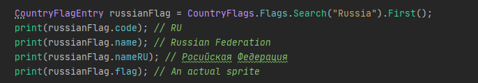
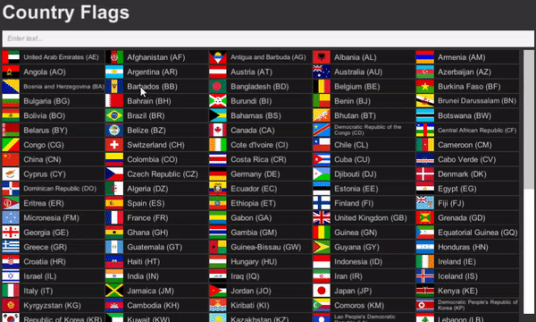

## Description
This asset has 186 country flags images with names and codes for Unity

## Installation
Just download `.unitypackage` from releases tab and import it to your project

## Usage

## In action

## Credits
Based on this package for Swift:
https://github.com/malczak/flag-icon-swift

Which is based on this package:
https://github.com/lipis/flag-icon-css
